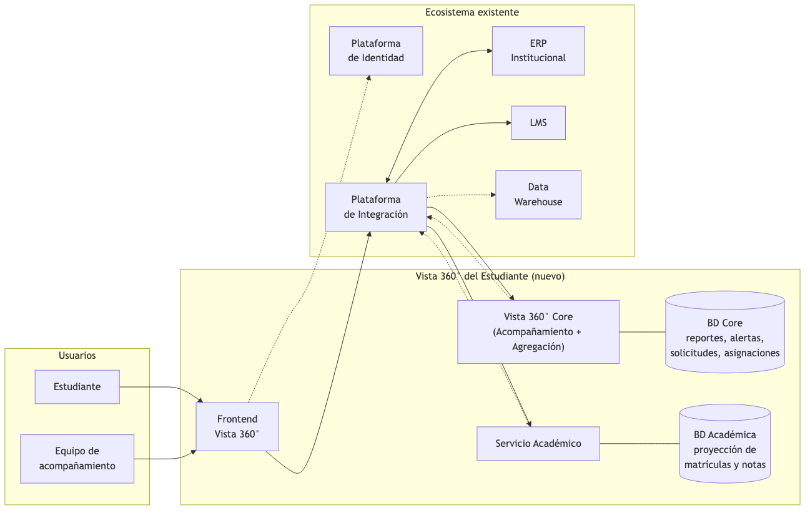
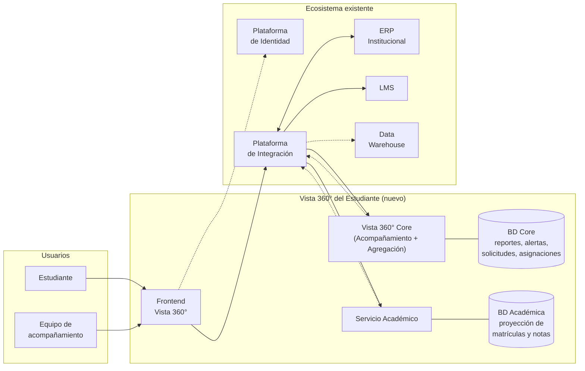
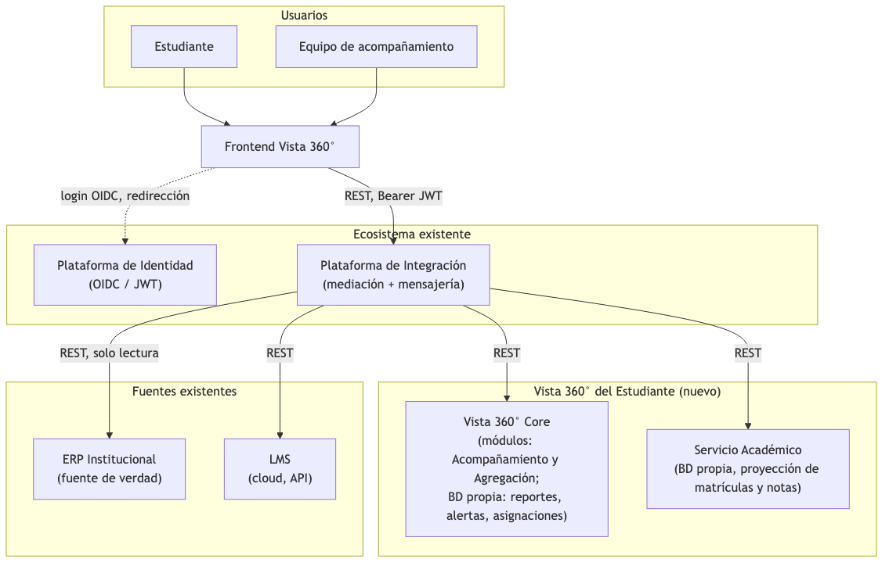
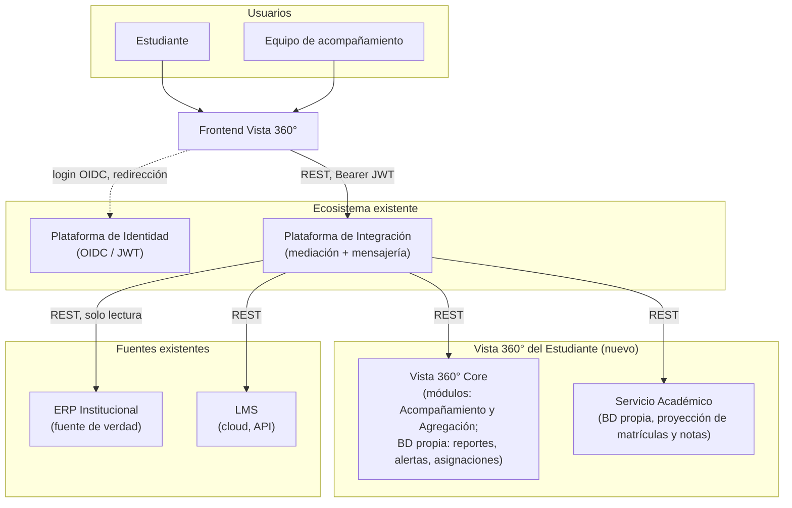
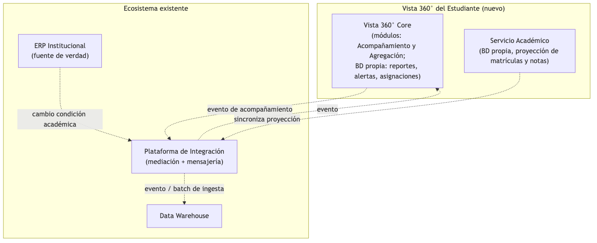
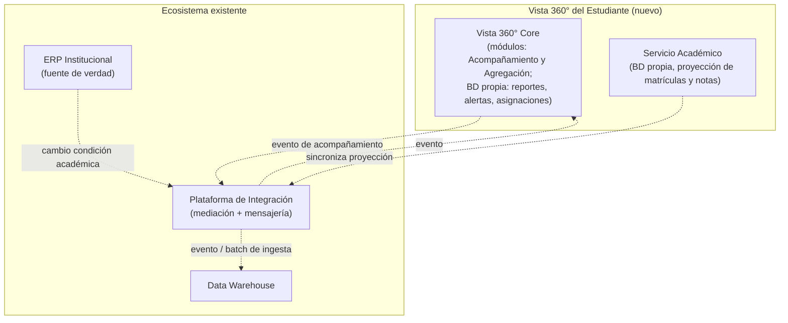

# Parte 1 · Diseño de la arquitectura

Este documento presenta el diagrama de arquitectura de Vista 360° del Estudiante y las decisiones que lo sostienen. Se apoya en la hoja de supuestos (`00-supuestos.md`), referenciada aquí por identificador (SUP-XX) cada vez que una decisión depende de uno declarado allí. La declaración de uso de herramientas de IA que pide el enunciado está en el [README](../README.md#uso-de-herramientas-de-inteligencia-artificial) y al final de `00-supuestos.md`.

La arquitectura se compone de dos aplicaciones nuevas y desplegables de forma independiente, tal como se fijó en SUP-05b: el **Servicio Académico** (microservicio, exigido como pieza propia por la Parte 2) y **Vista 360° Core** (monolito modular, con los módulos internos Acompañamiento y Agregación). El resto del ecosistema ya existe y no se modifica.

## Diagrama general de componentes

El mapa general muestra todos los componentes de la solución y del ecosistema en una sola imagen, sin etiquetas de protocolo, para servir de portada. El detalle de cada tipo de comunicación se desarrolla después en dos vistas separadas: juntar el flujo síncrono y el asíncrono en un mismo diagrama con todas sus etiquetas satura las flechas y dificulta la lectura, así que cada vista cuenta una sola historia.

### Vista 0: mapa general de la arquitectura

Código fuente del diagrama

### Vista 1: flujo síncrono (consultas del usuario)

Código fuente del diagrama

### Vista 2: flujo asíncrono (eventos y sincronización de fondo)

Código fuente del diagrama

**Cómo leer ambas vistas:** línea sólida es comunicación síncrona (pido y espero respuesta); línea punteada es comunicación asíncrona (evento o sincronización de fondo). En la Vista 1, todo el tráfico síncrono hacia sistemas externos pasa por la Plataforma de Integración como puerta de enlace única, en vez de que cada aplicación de Vista 360° hable directo con el ERP o el LMS. Esa decisión centraliza en un solo punto la protección de esas APIs y contiene el impacto si el ERP cambia un endpoint. La Vista 2 muestra por separado el otro tipo de tráfico, el que nadie está esperando en pantalla, el ERP avisa que algo cambió, y Vista 360° Core y el Servicio Académico se mantienen al día o publican sus propios cambios sin bloquear a ningún usuario.

Un detalle que el diagrama no muestra por claridad: tanto Vista 360° Core como el Servicio Académico validan la firma del JWT de forma local, usando la llave pública que publica la Plataforma de Identidad, sin hacer una llamada de red por cada petición (ver SUP-06). Se detalla en la Parte 3.1.

## Qué persiste cada pieza nueva

El enunciado deja explícitamente en manos del diseño qué persiste la nueva plataforma. Las dos piezas nuevas tienen base de datos propia, y ninguna comparte la suya con la otra:

- **Vista 360° Core** es el dueño de los datos que hoy no existen en ningún sistema (SUP-02): reportes de acompañamiento, alertas, solicitudes y la asignación estudiante–profesional (SUP-04). Persisten en una base de datos relacional propia de Core. Dentro de ella, el módulo Acompañamiento y el módulo Agregación mantienen esquemas separados (la frontera estricta de código y de esquema de SUP-05b): Acompañamiento posee las tablas de dominio recién listadas; Agregación no posee dominio propio —arma la vista consolidada pidiendo datos a las fuentes— y su esquema se limita a lo operativo (caché corta del LMS con TTL, si se materializa, y estado técnico). Esa separación es lo que permitiría extraer Agregación como servicio independiente si algún día creciera, sin desenredar tablas.
- **El Servicio Académico** persiste su proyección de matrículas y notas, sincronizada desde el ERP (SUP-07). Su modelo completo está en [`03-modelo-datos.md`](03-modelo-datos.md).

Elección de motor: relacional (PostgreSQL) para ambas, por la misma razón en los dos casos: son datos estructurados, con relaciones claras y necesidad de integridad referencial y de transacciones; nada en el caso exige un modelo documental o de grafos que justifique operar otro motor.

**Despliegue.** Las piezas nuevas (Frontend, Core, Servicio Académico y sus bases) se despliegan en la nube institucional o en el datacenter propio según la política vigente; lo único que la arquitectura exige es que su camino al ERP —que es on-premise— pase por la Plataforma de Integración, de modo que la decisión de dónde corre Vista 360° no cambia ningún contrato. El LMS ya se consume por API pública en la nube, así que es indiferente a esta decisión.

## De dónde sale cada dato, y por qué

| Dato que necesita Vista 360° | Origen | Por qué se resolvió así |
|---|---|---|
| Identidad, autenticación (usuario, rol) | Plataforma de identidad (JWT) | Estándar abierto ya disponible (SUP-06), no se reinventa autenticación. |
| Datos personales del estudiante | ERP, vía API si existe, si no, adaptador de solo lectura sobre réplica | ERP es fuente de verdad (SUP-01), nunca acceso directo a su BD productiva (SUP-08). |
| Estado financiero (saldo, paz y salvo) | ERP, en vivo, sin caché | Dato sensible a estar desactualizado (SUP-14), ver Escenario A de la Parte 3. |
| Matrículas y notas actuales | Servicio Académico (propio), sincronizado desde el ERP | Exigido como pieza propia por la Parte 2, se materializa para no depender del ERP en cada lectura (SUP-07). |
| Actividad de campus virtual | LMS, vía su API, con caché corta | Fuente única, ya expuesta por API (SUP-11), tolera caché de minutos (SUP-15). |
| Reportes de acompañamiento, alertas, solicitudes | Módulo Acompañamiento (Vista 360° Core) | Dato 100% nuevo, no existe en ningún sistema (SUP-02), Vista 360° es su dueño. |
| Asignación estudiante-profesional | Módulo Acompañamiento (Vista 360° Core) | Mismo dominio que el anterior, necesaria para resolver autorización (SUP-02, SUP-04). |
| Cambio de condición académica (evento) | ERP, vía evento publicado a través de la plataforma de integración | Debe propagarse temprano hacia otros procesos y al DWH (SUP-10), ver Escenario B de la Parte 3. |
| Modelos y tableros analíticos | Data warehouse, alimentado por Vista 360° | Vista 360° es origen, no dueño del modelo dimensional (SUP-12). |

## Cómo se comunican los componentes

| Interacción | Patrón | Por qué |
|---|---|---|
| Frontend a Vista 360° Core / Servicio Académico | Síncrono, REST sobre HTTPS, vía la plataforma de integración | El usuario espera respuesta en pantalla, no hay nada que ganar con asíncrono aquí. |
| Vista 360° Core (Agregación) a ERP, LMS | Síncrono, vía plataforma de integración | Datos que se piden bajo demanda para armar la vista consolidada. |
| Vista 360° Core (Agregación) a ERP, dato financiero | Síncrono, en vivo, sin caché | SUP-14, la corrección pesa más que la latencia en este dato puntual. |
| Servicio Académico a ERP | Asíncrono, eventos vía plataforma de integración, o consulta periódica si el ERP no emite eventos | Es sincronización de una proyección propia, no una respuesta esperada en pantalla, evita golpear al ERP en cada lectura. |
| ERP a Vista 360° Core (Acompañamiento) y a Data warehouse, ante cambio de condición académica | Asíncrono, evento con múltiples suscriptores | Ver Escenario B de la Parte 3 en `04-parte-3.md`, un solo evento, varios interesados, desacopla al ERP de saber quién consume el cambio. |
| Vista 360° Core y Servicio Académico a Data warehouse | Asíncrono: evento para lo que alimenta intervención temprana (cambios de condición, alertas), exportación periódica para el resto | SUP-12, Vista 360° no escribe directo al modelo dimensional, solo publica hacia la capa de ingesta. El criterio: si el dato pierde valor con las horas (una alerta), viaja como evento; si solo alimenta tableros e históricos (actividad, notas consolidadas), un batch diario cuesta menos de operar. |
| Todos los servicios con la Plataforma de identidad | Validación local de JWT por firma | Cada servicio valida el token que recibe, sin llamada de red por petición (SUP-06). |

## Escenarios de comunicación (Parte 3.2)

Los dos escenarios de comunicación que pide la Parte 3 (consulta del estado financiero en tiempo real, y propagación de un cambio de condición académica) se resuelven con este mismo diseño de comunicación síncrona/asíncrona. Su desarrollo completo, con los diagramas de secuencia y la argumentación, está en [`04-parte-3.md`](04-parte-3.md).

## Decisiones clave de esta parte

1. **Dos piezas desplegables, no una ni varias** (SUP-05b): Servicio Académico como microservicio propio, Vista 360° Core como monolito modular. La escala de Icesi (~10.000 estudiantes, SUP-20) no justifica el costo de operar más piezas distribuidas.
2. **La plataforma de integración es la única puerta de salida hacia el ERP y el LMS.** Ninguna aplicación de Vista 360° les habla directo. Esto contiene el impacto de cualquier cambio en esos sistemas y centraliza la protección de sus APIs.
3. **Vista 360° nunca accede directo a la base de datos del ERP** (SUP-08). Donde no hay API, hay un adaptador dedicado detrás de la plataforma de integración.
4. **Lo síncrono es para lo que el usuario espera ver en pantalla; lo asíncrono es para propagar cambios.** Esta separación es la que resuelve limpio los dos escenarios de comunicación de la Parte 3, desarrollados en [`04-parte-3.md`](04-parte-3.md).
5. **El dato financiero nunca se cachea; el resto sí, con ventanas distintas según su volatilidad** (SUP-14, SUP-15).