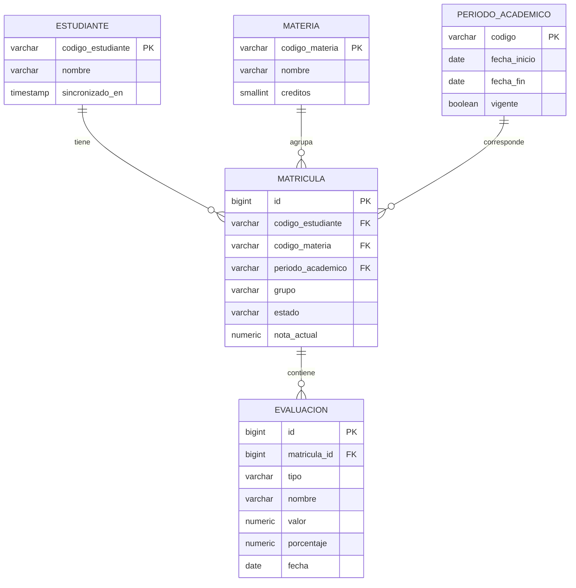

# Parte 2 · Modelo de datos

## Diagrama entidad-relación



## Por qué estas cinco tablas, y no más

- **`estudiante`, `materia`, `periodo_academico`**: catálogos mínimos. Son la copia local de lo que el ERP considera verdad (SUP-01, SUP-16); el servicio no guarda más datos del estudiante que su código y nombre, porque no es dueño de su información personal.
- **`matricula`**: es la tabla central. Representa "este estudiante cursa esta materia en este periodo, en este grupo, con este estado". Cada fila responde directamente al Endpoint 1.
- **`evaluacion`**: cuelga de `matricula`, no de `estudiante` ni de `materia` por separado, porque una evaluación solo tiene sentido en el contexto de una matrícula puntual (mismo estudiante, misma materia, mismo periodo). Cada fila responde al Endpoint 2.

No hay una tabla para "profesor" ni para "asignación estudiante-profesional": lo primero no lo pide el contrato, y lo segundo pertenece al módulo de Acompañamiento en Vista 360° Core (SUP-02), no a este servicio.

## Decisiones de modelado

- **`nota_actual` se almacena como columna en `matricula`, y se recalcula de forma automática, no manual.** Cada vez que se inserta, actualiza o elimina una evaluación de una matrícula, el mismo componente que hace ese cambio recalcula el promedio ponderado y actualiza `nota_actual` dentro de la misma transacción. Es el mismo patrón que usan sistemas de gestión de cursos como Moodle o Canvas: la nota consolidada se lee directo, sin recalcular en cada consulta, pero el recálculo nunca depende de que alguien se acuerde de hacerlo a mano, es parte automática de la operación de escritura. A la escala de Icesi este patrón no era indispensable por rendimiento, pero se adoptó para quedar alineado con la práctica estándar de la industria en este tipo de dato.
- **`periodo_academico.vigente` es una columna explícita, no inferida por fecha.** Un proceso de sincronización la actualiza. Se prefirió así porque el corte real de un semestre (exámenes finales, cierre de notas) no siempre coincide con el rango de fechas "de calendario", y una columna explícita es más fácil de corregir manualmente si algo se desfasa.
- **Restricción de unicidad en `matricula`**: `(codigo_estudiante, codigo_materia, periodo_academico)` no se repite. Un estudiante no puede estar matriculado dos veces en la misma materia en el mismo periodo.
- **`valor` usa escala `0.00` a `5.00`**, la escala colombiana estándar de calificación.

## Script de migración inicial

```sql
CREATE TABLE estudiante (
    codigo_estudiante   VARCHAR(20)   PRIMARY KEY,
    nombre              VARCHAR(150)  NOT NULL,
    sincronizado_en     TIMESTAMP     NOT NULL DEFAULT CURRENT_TIMESTAMP
);

CREATE TABLE materia (
    codigo_materia      VARCHAR(20)   PRIMARY KEY,
    nombre              VARCHAR(150)  NOT NULL,
    creditos            SMALLINT      NOT NULL CHECK (creditos > 0)
);

CREATE TABLE periodo_academico (
    codigo              VARCHAR(10)   PRIMARY KEY,
    fecha_inicio        DATE          NOT NULL,
    fecha_fin           DATE          NOT NULL,
    vigente             BOOLEAN       NOT NULL DEFAULT FALSE
);

CREATE TABLE matricula (
    id                  BIGSERIAL     PRIMARY KEY,
    codigo_estudiante   VARCHAR(20)   NOT NULL REFERENCES estudiante(codigo_estudiante),
    codigo_materia      VARCHAR(20)   NOT NULL REFERENCES materia(codigo_materia),
    periodo_academico   VARCHAR(10)   NOT NULL REFERENCES periodo_academico(codigo),
    grupo               VARCHAR(5)    NOT NULL,
    estado              VARCHAR(20)   NOT NULL DEFAULT 'EN_CURSO'
                                       CHECK (estado IN ('EN_CURSO', 'APROBADA', 'REPROBADA', 'CANCELADA')),
    nota_actual         NUMERIC(3,2)  NULL CHECK (nota_actual >= 0.00 AND nota_actual <= 5.00),
    CONSTRAINT uq_matricula UNIQUE (codigo_estudiante, codigo_materia, periodo_academico)
);

CREATE INDEX idx_matricula_estudiante_periodo ON matricula (codigo_estudiante, periodo_academico);

CREATE TABLE evaluacion (
    id                  BIGSERIAL     PRIMARY KEY,
    matricula_id        BIGINT        NOT NULL REFERENCES matricula(id),
    tipo                VARCHAR(20)   NOT NULL
                                       CHECK (tipo IN ('PARCIAL', 'QUIZ', 'TAREA', 'PROYECTO', 'EXAMEN_FINAL', 'OTRO')),
    nombre              VARCHAR(150)  NOT NULL,
    valor               NUMERIC(3,2)  NOT NULL CHECK (valor >= 0.00 AND valor <= 5.00),
    porcentaje          NUMERIC(5,2)  NOT NULL CHECK (porcentaje > 0.00 AND porcentaje <= 100.00),
    fecha               DATE          NOT NULL
);

CREATE INDEX idx_evaluacion_matricula ON evaluacion (matricula_id);
```

## Supuestos declarados para esta parte

- **El catálogo de materias y periodos también se sincroniza desde el ERP**, por el mismo mecanismo asíncrono que las matrículas (ver `01-arquitectura.md`, Servicio Académico a ERP). No se modela cómo se resuelve esa sincronización en detalle, es responsabilidad de un componente aparte (un proceso o job de sincronización), fuera del alcance de este servicio de lectura.
- **Las evaluaciones también llegan sincronizadas desde el ERP** (o desde el sistema que el profesor use para calificar), no se capturan desde Vista 360°. El servicio expone lo que ya existe, no ofrece una pantalla para que un profesor califique.
- **El recálculo de `nota_actual` vive en el componente de sincronización de evaluaciones**, no en los endpoints de consulta del Servicio Académico (que son de solo lectura). Cuando ese componente sincroniza una evaluación nueva o modificada desde el ERP, recalcula el promedio ponderado y actualiza `nota_actual` dentro de la misma transacción, siguiendo el mismo patrón de sistemas de gestión de cursos como Moodle.
