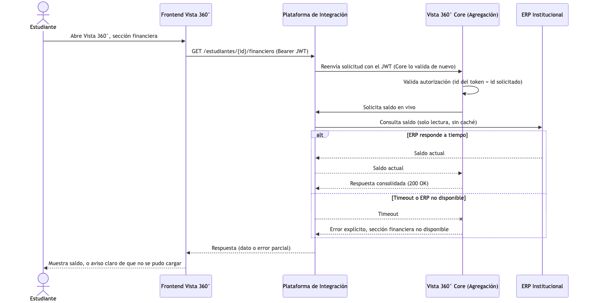
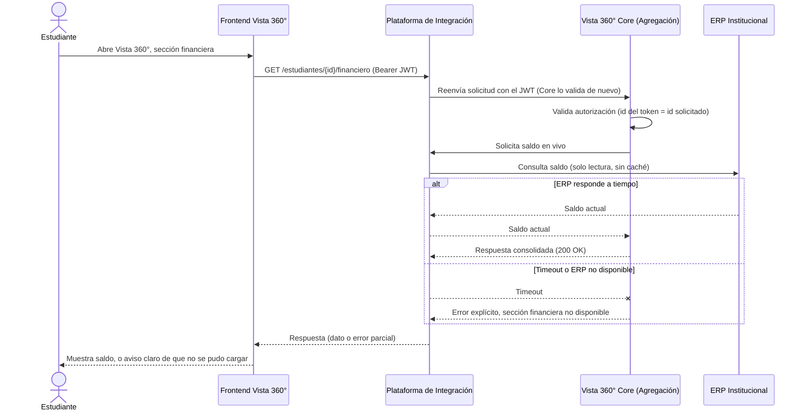
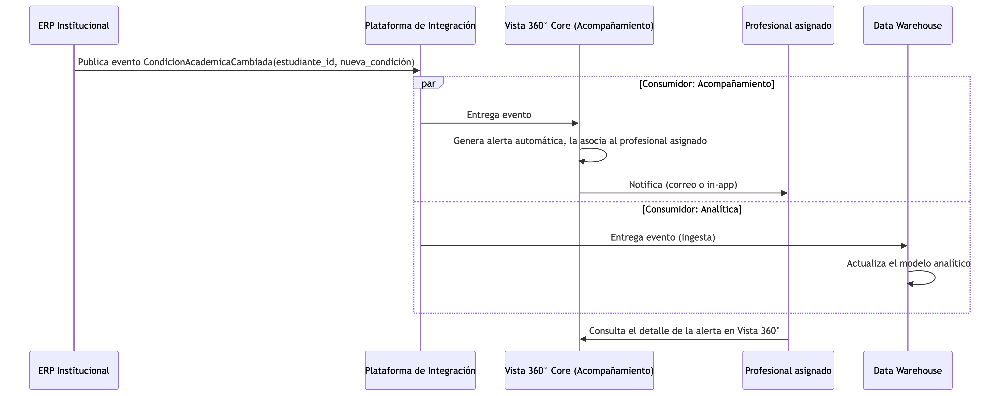
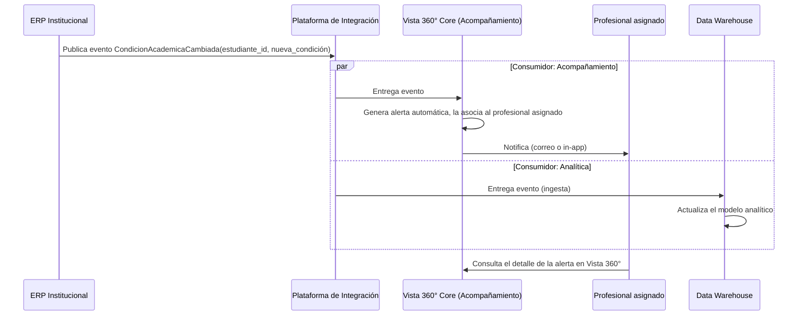

# Parte 3 · Seguridad y comunicación

Este documento se apoya en `00-supuestos.md` (referenciado como SUP-XX) y en la arquitectura general descrita en `01-arquitectura.md`. Donde aplica, cita decisiones ya verificadas en el código del Servicio Académico (Parte 2), no solo en el papel. La declaración de uso de herramientas de IA está en el [README](../README.md#uso-de-herramientas-de-inteligencia-artificial).

## 3.1 Seguridad: autenticación y autorización

El enunciado pide cubrir tres relaciones distintas: estudiantes y personal de acompañamiento entrando a Vista 360°, el frontend consumiendo servicios de backend, y servicios internos comunicándose entre sí. Cada una se resuelve distinto, pero las tres comparten un único mecanismo de base: un JWT emitido por la plataforma de identidad (SUP-06), validado localmente por cada servicio que lo recibe.

### Autenticación: cómo se establece la identidad

El estudiante y el profesional de acompañamiento usan el mismo Frontend y el mismo flujo de inicio de sesión, un *Authorization Code* con PKCE contra la plataforma de identidad institucional. No hay dos mecanismos de login distintos según el rol; lo que cambia es el contenido del token que resulta: un claim `rol` (`ESTUDIANTE` o `ACOMPANAMIENTO`) y un claim `sub` con el código institucional del usuario (el mismo identificador canónico de SUP-13, para que se pueda correlacionar contra cualquier sistema del ecosistema).

Cada servicio backend (Vista 360° Core, Servicio Académico) actúa como *Resource Server*: valida la firma del JWT contra la llave pública que publica la plataforma de identidad, **sin llamada de red por petición**. La validación no se queda en la firma y la vigencia: cada servicio verifica también el emisor (`iss`) y que el token haya sido emitido para él (`aud`); sin esa última verificación, un token legítimo emitido para otro consumidor de la misma plataforma de identidad serviría contra cualquier servicio del ecosistema. Esto no es solo una decisión de diseño, ya está implementado y probado en el Servicio Académico (`SecurityConfig`, con `NimbusJwtDecoder.withPublicKey(...)` más validadores de emisor y audiencia): cada servicio confía en la firma, no en volver a preguntarle al emisor si el token es válido. La razón de fondo es doble: evita que la plataforma de identidad se vuelva un punto único de fallo síncrono para cada petición del sistema, y mantiene el patrón consistente con SUP-06, donde ya se había declarado esta preferencia por validación local.

### Autorización: dos capas, cada una resuelta donde vive el dato

La autorización de negocio se separa en dos capas, y cada una se resuelve en el servicio dueño del dato que la sustenta, no se duplica en cascada:

**Capa 1, identidad contra lo solicitado.** Cada servicio, al recibir una petición con un token de rol de usuario final, verifica que el recurso pedido corresponda a la identidad del token. Un estudiante solo puede pedir su propia información: el `codigoEstudiante` de la ruta debe coincidir con el `sub` del token, si no, `403`. Esta regla es simple, no requiere conocer nada del resto del sistema, y por eso puede vivir en cada servicio de forma independiente sin coordinación. Es exactamente lo que hace `AutorizacionHelper` en el Servicio Académico hoy.

**Capa 2, la asignación estudiante-profesional.** Un profesional de acompañamiento solo puede ver a los estudiantes que tiene asignados (SUP-02, SUP-04). Ese dato de asignación es propiedad exclusiva del módulo de Acompañamiento en Vista 360° Core, así que **la validación ocurre una sola vez, ahí**, no en cada servicio que el profesional termine consultando. Cuando Vista 360° Core necesita, por ejemplo, las notas de un estudiante para completar la vista de un profesional, no reenvía el token del profesional tal cual: llama al Servicio Académico con un **token de servicio** propio (flujo *Client Credentials*, claim `rol=SERVICE`), que representa a Vista 360° Core, no a la persona. El Servicio Académico confía en que, si recibe ese token, la validación de la asignación ya ocurrió aguas arriba; por diseño, no la repite, porque no es dueño de ese dato.

Esta separación evita el error más común en sistemas con varios servicios: que la misma regla de negocio (¿está este estudiante asignado a este profesional?) se implemente varias veces, en varios lugares, y con el tiempo alguna copia quede desactualizada respecto a las demás.

**El director de centro de apoyo se resuelve en la misma Capa 2, no con un rol nuevo por servicio.** SUP-03 declara que un director ve a los estudiantes de los profesionales de su centro. Ese alcance es, otra vez, un dato del que solo el módulo Acompañamiento es dueño: la relación profesional→centro vive junto a la asignación estudiante–profesional. Así que el token del director lleva el mismo claim `rol=ACOMPANAMIENTO` (más un claim de perfil que distingue director de profesional para la interfaz), y la Capa 2 expande su consulta: en vez de "¿está este estudiante asignado a este token?", resuelve "¿está asignado a algún profesional del centro de este token?". Ningún otro servicio del ecosistema necesita conocer la jerarquía de centros: para el Servicio Académico, la petición llega igual que cualquier otra, con el token de servicio de Core, porque la validación del alcance ya ocurrió donde vive el dato. El perfil administrador de la plataforma queda fuera del flujo de datos de estudiantes: administra catálogos y configuración, no consulta información académica, y por eso no aparece en estas reglas.

### Comunicación entre el frontend y los servicios de backend

El Frontend nunca le habla directo al ERP, al LMS, ni a la base de datos de ningún sistema. Toda petición síncrona pasa por la plataforma de integración como puerta de enlace única (ver `01-arquitectura.md`), con el JWT del usuario como cabecera `Authorization: Bearer`. La puerta de enlace no reemplaza la validación de cada servicio (cada uno sigue validando el token que recibe), pero sí centraliza TLS, límites de tasa, y el punto donde cortar el tráfico si algo se comporta mal.

### Comunicación entre servicios internos

Cuando un servicio le habla a otro (Vista 360° Core llamando al Servicio Académico, por ejemplo), usa un token de servicio propio, no reenvía el token del usuario final. Esto tiene dos beneficios: el servicio receptor no necesita dos mecanismos de autorización distintos según quién llama (siempre valida un JWT con un `rol`, sea de usuario o de servicio), y la relación de confianza entre servicios queda explícita y auditable, en vez de ser un reenvío implícito de credenciales ajenas.

### Cómo no se pierde de vista quién disparó la consulta original

Usar un token de servicio genérico tiene una consecuencia que hay que resolver aparte: el Servicio Académico, al recibir ese token, sabe que quien pregunta es "Vista 360° Core", pero no sabe **en nombre de qué profesional puntual** se está haciendo esa consulta. Y esa información sí hace falta, porque el registro de auditoría de la Parte 4 (Escenario B) debe poder responder "¿qué profesional consultó a este estudiante?", no solo "¿qué servicio lo consultó?".

La solución no toca el mecanismo de autorización, que sigue dependiendo únicamente del token de servicio, y no se complica con un intercambio de tokens (la alternativa más rigurosa, llamada *Token Exchange*, donde el token mismo llevaría la identidad original incrustada). En vez de eso, Vista 360° Core añade un dato adicional a la petición, un encabezado HTTP (`X-Actuando-En-Nombre-De: <código del profesional>`), puramente informativo.

Dos reglas hacen que esto sea seguro y no un atajo peligroso:

- **Este encabezado nunca participa en la decisión de autorización.** El Servicio Académico sigue autorizando solo con base en el `rol` del token (`SERVICE` accede a cualquier estudiante, como ya se definió). El encabezado no habilita ni restringe nada por sí mismo; si llegara vacío o ausente, la petición se sigue resolviendo igual.
- **Se usa exclusivamente para quedar registrado en la auditoría.** El Servicio Académico lo toma y lo guarda junto con el resto del registro de acceso (quién, qué, cuándo), como el dato de "en representación de quién" se hizo esa consulta puntual.

Es la misma idea que una carta poder en un trámite bancario: el cajero no valida la identidad de quien firma contra la carta, esa validación ya se hizo antes; pero sí anota en el registro quién actuó en nombre de quién, para que quede constancia.

**El límite honesto de este mecanismo.** El encabezado es un dato que Vista 360° Core *afirma*, no algo que el Servicio Académico *verifica*. Si el token de servicio de Core llegara a verse comprometido, quien lo explote no solo podría leer la información de cualquier estudiante, también podría escribir cualquier código de profesional en ese encabezado. El registro de auditoría del Servicio Académico, en ese caso, quedaría atribuyendo el acceso a una persona que nunca lo hizo.

Dicho de otra forma: el registro del Servicio Académico prueba "Core afirmó que actuaba en nombre de X", no "X consultó de verdad". Para responder con la certeza que exige el Escenario B de la Parte 4, no basta ese registro solo: hace falta cruzarlo con el propio registro de acceso de Vista 360° Core, que sí autenticó al profesional con su token de usuario en el primer salto. Es la misma lógica de correlación que ya se usa para cruzar el registro de acceso con la asignación vigente en la fecha del reclamo (ver `05-parte-4.md`), aplicada ahora a la identidad en sí, no solo al permiso.

### Supuestos declarados para esta parte

- **Los tokens de usuario son de corta duración** (del orden de una hora), con renovación silenciosa a través del flujo estándar de OIDC. No se declara un mecanismo de revocación inmediata (como una lista de tokens revocados) porque, a esta escala y con esta duración corta, el costo de construirlo no se justifica frente al riesgo que mitiga; si la Universidad lo exige por política, se añade sin cambiar el resto del diseño.
- **Los tokens de servicio (Client Credentials) se emiten por cliente registrado**, no por instancia de máquina. Cada servicio que necesita llamar a otro tiene sus propias credenciales de cliente en la plataforma de identidad, y esas credenciales pueden rotarse o revocarse sin afectar a los demás.
- **No se exige mTLS entre servicios internos.** La combinación de JWT firmado más una red interna segmentada es suficiente a esta escala; mTLS añadiría un costo operativo de gestión de certificados que no está justificado por el nivel de riesgo actual. Si el ecosistema creciera o el criterio de la Universidad lo exigiera, es una capa que se añade sin rediseñar la autorización.
- **El encabezado `X-Actuando-En-Nombre-De` es de confianza porque solo lo puede enviar quien ya tiene un token de servicio válido**, es decir, Vista 360° Core, un cliente registrado y de confianza. No es un dato que un usuario final pueda inyectar directamente; si en algún momento se expusiera un canal donde eso fuera posible, el encabezado tendría que dejar de usarse sin verificación adicional, precisamente porque nunca participa en la autorización, solo en la auditoría.

## 3.2 Comunicación

### Escenario A: estado financiero en tiempo real



<details>
<summary>Código fuente del diagrama</summary>


</details>

La consulta se resuelve **en vivo contra el ERP, sin caché**, porque un saldo desactualizado tiene consecuencias reales para el estudiante: puede creerse a paz y salvo sin estarlo, o al revés (SUP-14). Es la única excepción a la política general de cachear datos de baja volatilidad (SUP-15); aquí la corrección pesa más que la latencia.

Si el ERP no responde a tiempo, la sección financiera se marca como no disponible de forma explícita, en vez de mostrar un dato viejo o dejar la pantalla en blanco sin explicación (SUP-21). Este mismo mecanismo es el que se detalla como respuesta al Escenario A de la Parte 4 (`05-parte-4.md`): la capacidad de degradar una sección puntual sin tumbar el resto de la vista es lo que hace viable diagnosticar y contener un incidente de este tipo.

**Una alternativa descartada, y bajo qué condición dejaría de estarlo.** Cachear el estado financiero con una ventana de tiempo fija (por ejemplo, 5 minutos) se descartó porque no protege el peor caso: un estudiante que paga justo antes de un cierre de matrícula y consulta minutos después vería un saldo viejo, precisamente en el momento donde más importa que sea correcto. Una ventana fija trata todos los instantes igual, sin distinguir cuándo el dato es crítico.

Hay una versión distinta de caché que sí resolvería esto bien: **invalidación por evento**, no por tiempo. El ERP publicaría un evento cada vez que el saldo de un estudiante cambia (el mismo mecanismo asíncrono del Escenario B, solo que para un dato distinto), y Vista 360° Core actualizaría, en el momento en que llega ese evento, una copia propia del saldo. Las lecturas irían contra esa copia, no contra el ERP en vivo. Esto daría lo mejor de los dos mundos, lecturas rápidas casi siempre, y corrección garantizada, porque la copia nunca queda desactualizada por más tiempo del que tarda el evento en propagarse (segundos, no minutos).

El motivo por el que no se adoptó para este diseño es que **depende de una capacidad del ERP que no está confirmada**: que pueda emitir un evento en el momento exacto en que se procesa un cambio financiero, no solo por lotes o de forma periódica. Consultar en vivo es la opción que funciona sin necesitar esa garantía. Si se confirmara que el ERP sí puede emitir esos eventos en tiempo real, la invalidación por evento sería la mejor opción, más rápida y sin sacrificar corrección.

Vale la pena notar una consecuencia de adoptar esa alternativa: Vista 360° Core (Agregación) pasaría a guardar, por primera vez, una copia propia de un dato financiero, algo que hoy no hace (ver "Qué persiste cada pieza nueva" en `01-arquitectura.md`: Agregación no posee dominio propio, arma la vista pidiendo datos a las fuentes). Dejaría de ser puramente una capa de paso para este dato en particular, igual que el Servicio Académico ya lo es para las notas.

### Escenario B: cambio de condición académica



<details>
<summary>Código fuente del diagrama</summary>


</details>

El ERP publica **un único evento**, y la plataforma de integración lo entrega a todos los interesados, sin que el ERP necesite saber quién los consume (SUP-09, SUP-10). Esto es lo que permite "actuar de forma temprana": la alerta llega al profesional asignado sin depender de que alguien revise el ERP manualmente, y el data warehouse queda sincronizado por el mismo evento, no por un proceso aparte que alguien tenga que recordar ejecutar.

Un detalle que vale la pena hacer explícito: la plataforma de integración entrega con garantía **al menos una vez** (SUP-09), lo que significa que el mismo evento puede llegar duplicado. El consumidor de Acompañamiento, igual que el sincronizador de evaluaciones del Servicio Académico (ver `03-modelo-datos.md` y la migración `V3__idempotencia_sincronizacion.sql`), debe estar diseñado para que reprocesar el mismo evento no genere una alerta duplicada ni un estado inconsistente.

**El contrato del evento.** El evento es un hecho de negocio con esquema propio y versionado, no una notificación mínima:

```json
{
  "tipo": "CondicionAcademicaCambiada",
  "version": 1,
  "idEvento": "uuid del hecho en el origen (la clave de idempotencia)",
  "ocurridoEn": "fecha y hora del cambio en el ERP",
  "estudianteId": "código institucional (SUP-13)",
  "condicionAnterior": "NORMAL",
  "condicionNueva": "PRUEBA_ACADEMICA"
}
```

Dos decisiones dentro de ese esquema importan más que el resto. Primera: el evento lleva **la condición anterior además de la nueva**, porque "actuar de forma temprana" exige criterio: pasar de NORMAL a PRUEBA_ACADEMICA amerita una alerta con prioridad distinta que el regreso de PRUEBA_ACADEMICA a NORMAL, y sin el valor anterior el consumidor tendría que ir a preguntárselo al ERP, reintroduciendo el acoplamiento que el evento venía a quitar. Segunda: el campo `version` permite evolucionar el esquema sin coordinar despliegues; los cambios compatibles (añadir un campo) no suben la versión, y ante un cambio incompatible los consumidores declaran qué versiones entienden.

**Qué pasa si un consumidor falla.** Reintentar es la primera respuesta (para eso la entrega es al menos una vez), pero un evento que falla siempre —un dato corrupto, un estudiante que el consumidor no conoce aún— no puede quedarse bloqueando la fila ni descartarse en silencio: tras agotar los reintentos, la plataforma de integración lo aparta a una **cola de mensajes fallidos** (dead letter queue) con alerta al equipo de operación. Eso convierte "se perdió una alerta de condición académica" —invisible hasta que alguien pregunta— en un incidente visible y con evidencia, que es exactamente la propiedad que la Parte 4 exige del sistema.

**Cómo publica Core sus propios eventos sin mentir.** La Vista 2 de la arquitectura muestra que Core también publica (por ejemplo, "alerta de acompañamiento creada"). Escribir la alerta en su base y publicar el evento son dos operaciones, y entre ambas el proceso puede morir. Para no publicar hechos que no se guardaron ni guardar hechos que nunca se publican, Core escribe el evento en una tabla de salida (**patrón outbox**) dentro de la misma transacción que la alerta, y un proceso aparte lo publica desde ahí a la plataforma de integración. La garantía de idempotencia de los consumidores absorbe el caso de publicación repetida.

**La ruta hacia el data warehouse.** El diagrama simplifica la flecha como integración→DWH; en la práctica el DWH no consume el evento crudo directamente: lo recibe **la capa de ingesta** declarada en SUP-12, que lo aterriza en una zona de datos crudos y desde ahí los procesos del equipo de analítica lo transforman al modelo dimensional. La distinción importa por propiedad, no por tecnología: Vista 360° y el ERP garantizan publicar hechos correctos y con esquema estable; cómo se modelan dentro del DWH es del equipo de analítica, y ningún cambio de su modelo obliga a tocar a los productores.