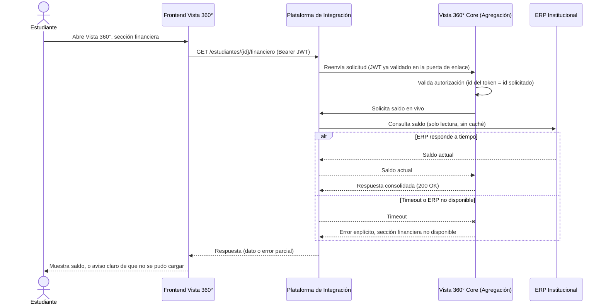
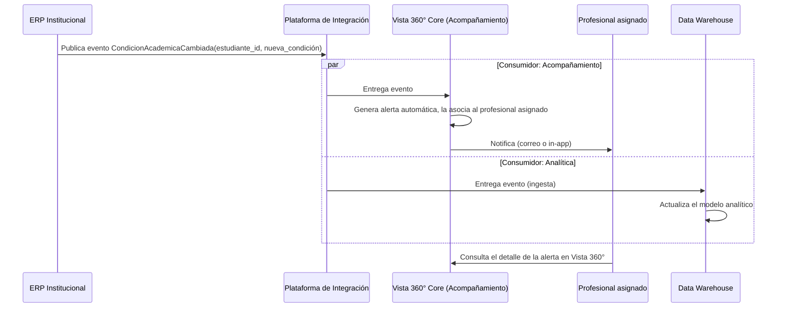

# Parte 3 · Seguridad y comunicación

Este documento se apoya en `00-supuestos.md` (referenciado como SUP-XX) y en la arquitectura general descrita en `01-arquitectura.md`. Donde aplica, cita decisiones ya verificadas en el código del Servicio Académico (Parte 2), no solo en el papel.

## 3.1 Seguridad: autenticación y autorización

El enunciado pide cubrir tres relaciones distintas: estudiantes y personal de acompañamiento entrando a Vista 360°, el frontend consumiendo servicios de backend, y servicios internos comunicándose entre sí. Cada una se resuelve distinto, pero las tres comparten un único mecanismo de base: un JWT emitido por la plataforma de identidad (SUP-06), validado localmente por cada servicio que lo recibe.

### Autenticación: cómo se establece la identidad

El estudiante y el profesional de acompañamiento usan el mismo Frontend y el mismo flujo de inicio de sesión, un *Authorization Code* con PKCE contra la plataforma de identidad institucional. No hay dos mecanismos de login distintos según el rol; lo que cambia es el contenido del token que resulta: un claim `rol` (`ESTUDIANTE` o `ACOMPANAMIENTO`) y un claim `sub` con el código institucional del usuario (el mismo identificador canónico de SUP-13, para que se pueda correlacionar contra cualquier sistema del ecosistema).

Cada servicio backend (Vista 360° Core, Servicio Académico) actúa como *Resource Server*: valida la firma del JWT contra la llave pública que publica la plataforma de identidad, **sin llamada de red por petición**. Esto no es solo una decisión de diseño, ya está implementado y probado en el Servicio Académico (`SecurityConfig`, con `NimbusJwtDecoder.withPublicKey(...)`): cada servicio confía en la firma, no en volver a preguntarle al emisor si el token es válido. La razón de fondo es doble: evita que la plataforma de identidad se vuelva un punto único de fallo síncrono para cada petición del sistema, y mantiene el patrón consistente con SUP-06, donde ya se había declarado esta preferencia por validación local.

### Autorización: dos capas, cada una resuelta donde vive el dato

La autorización de negocio se separa en dos capas, y cada una se resuelve en el servicio dueño del dato que la sustenta, no se duplica en cascada:

**Capa 1, identidad contra lo solicitado.** Cada servicio, al recibir una petición con un token de rol de usuario final, verifica que el recurso pedido corresponda a la identidad del token. Un estudiante solo puede pedir su propia información: el `codigoEstudiante` de la ruta debe coincidir con el `sub` del token, si no, `403`. Esta regla es simple, no requiere conocer nada del resto del sistema, y por eso puede vivir en cada servicio de forma independiente sin coordinación. Es exactamente lo que hace `AutorizacionHelper` en el Servicio Académico hoy.

**Capa 2, la asignación estudiante-profesional.** Un profesional de acompañamiento solo puede ver a los estudiantes que tiene asignados (SUP-02, SUP-04). Ese dato de asignación es propiedad exclusiva del módulo de Acompañamiento en Vista 360° Core, así que **la validación ocurre una sola vez, ahí**, no en cada servicio que el profesional termine consultando. Cuando Vista 360° Core necesita, por ejemplo, las notas de un estudiante para completar la vista de un profesional, no reenvía el token del profesional tal cual: llama al Servicio Académico con un **token de servicio** propio (flujo *Client Credentials*, claim `rol=SERVICE`), que representa a Vista 360° Core, no a la persona. El Servicio Académico confía en que, si recibe ese token, la validación de la asignación ya ocurrió aguas arriba; por diseño, no la repite, porque no es dueño de ese dato.

Esta separación evita el error más común en sistemas con varios servicios: que la misma regla de negocio (¿está este estudiante asignado a este profesional?) se implemente varias veces, en varios lugares, y con el tiempo alguna copia quede desactualizada respecto a las demás.

### Comunicación entre el frontend y los servicios de backend

El Frontend nunca le habla directo al ERP, al LMS, ni a la base de datos de ningún sistema. Toda petición síncrona pasa por la plataforma de integración como puerta de enlace única (ver `01-arquitectura.md`), con el JWT del usuario como cabecera `Authorization: Bearer`. La puerta de enlace no reemplaza la validación de cada servicio (cada uno sigue validando el token que recibe), pero sí centraliza TLS, límites de tasa, y el punto donde cortar el tráfico si algo se comporta mal.

### Comunicación entre servicios internos

Cuando un servicio le habla a otro (Vista 360° Core llamando al Servicio Académico, por ejemplo), usa un token de servicio propio, no reenvía el token del usuario final. Esto tiene dos beneficios: el servicio receptor no necesita dos mecanismos de autorización distintos según quién llama (siempre valida un JWT con un `rol`, sea de usuario o de servicio), y la relación de confianza entre servicios queda explícita y auditable, en vez de ser un reenvío implícito de credenciales ajenas.

### Supuestos declarados para esta parte

- **Los tokens de usuario son de corta duración** (del orden de una hora), con renovación silenciosa a través del flujo estándar de OIDC. No se declara un mecanismo de revocación inmediata (como una lista de tokens revocados) porque, a esta escala y con esta duración corta, el costo de construirlo no se justifica frente al riesgo que mitiga; si la Universidad lo exige por política, se añade sin cambiar el resto del diseño.
- **Los tokens de servicio (Client Credentials) se emiten por cliente registrado**, no por instancia de máquina. Cada servicio que necesita llamar a otro tiene sus propias credenciales de cliente en la plataforma de identidad, y esas credenciales pueden rotarse o revocarse sin afectar a los demás.
- **No se exige mTLS entre servicios internos.** La combinación de JWT firmado más una red interna segmentada es suficiente a esta escala; mTLS añadiría un costo operativo de gestión de certificados que no está justificado por el nivel de riesgo actual. Si el ecosistema creciera o el criterio de la Universidad lo exigiera, es una capa que se añade sin rediseñar la autorización.

## 3.2 Comunicación

### Escenario A: estado financiero en tiempo real

Código fuente del diagrama

La consulta se resuelve **en vivo contra el ERP, sin caché**, porque un saldo desactualizado tiene consecuencias reales para el estudiante: puede creerse a paz y salvo sin estarlo, o al revés (SUP-14). Es la única excepción a la política general de cachear datos de baja volatilidad (SUP-15); aquí la corrección pesa más que la latencia.

Si el ERP no responde a tiempo, la sección financiera se marca como no disponible de forma explícita, en vez de mostrar un dato viejo o dejar la pantalla en blanco sin explicación (SUP-21). Este mismo mecanismo es el que se detalla como respuesta al Escenario A de la Parte 4 (`05-parte-4.md`): la capacidad de degradar una sección puntual sin tumbar el resto de la vista es lo que hace viable diagnosticar y contener un incidente de este tipo.

### Escenario B: cambio de condición académica

Código fuente del diagrama

El ERP publica **un único evento**, y la plataforma de integración lo entrega a todos los interesados, sin que el ERP necesite saber quién los consume (SUP-09, SUP-10). Esto es lo que permite "actuar de forma temprana": la alerta llega al profesional asignado sin depender de que alguien revise el ERP manualmente, y el data warehouse queda sincronizado por el mismo evento, no por un proceso aparte que alguien tenga que recordar ejecutar.

Un detalle que vale la pena hacer explícito: la plataforma de integración entrega con garantía **al menos una vez** (SUP-09), lo que significa que el mismo evento puede llegar duplicado. El consumidor de Acompañamiento, igual que el sincronizador de evaluaciones del Servicio Académico (ver `03-modelo-datos.md` y la migración `V3__idempotencia_sincronizacion.sql`), debe estar diseñado para que reprocesar el mismo evento no genere una alerta duplicada ni un estado inconsistente.